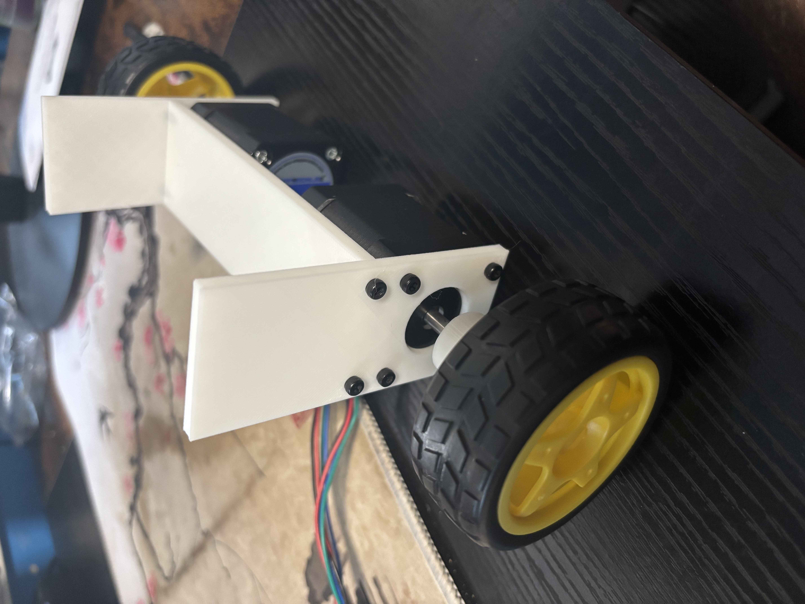

Self-Balancing Robot Project log

## June 4, 2026

### Current Prototype

## Current Problems

1. ### Wheel Adapter length
   - The adapter connecting the shaft to the wheel is currently longer than desired.
   - The increased distance of the adapter allows the robot to balance on its own which is not intended in my design.

     **Planned Solution**

   - Lower the total extrusion of shaft side of the adapter and the wheel connection in solidworks.

2. ### Wheel Attachment
   - The adapter is not fully connected inside the wheel due to unknown geometry, as of right now its just a close approximation.

     **Planned Solution**

   - Instead of trying to connect the adapter and the wheel internally I will use what is known already. I will instead
     use the diameter of the cylinder and make it attatch to that.

   - I will also utilize screws so there is no sliding of the adapter when the motor is turned on.

3. ### Structural Rigidity
   - The motor mounts connected with the plate isn't fully stable.

   - When lifted off the ground bending is caused on the plate due to lack of support.

     **Planned Solution**
     - Make the plate and the motor mounts seperate from each other.

     - Utilize screws to connect them together. This allows for better redsigning as well because
       if I need to print a new motor mount I dont need to reprint the entire plate alongisde with it.

## June 11, 2026

### PrototypeV1.1

**Side View**

**Front View**

## Design Changes

- Added screws to connect the plate directly to the motor mounts.
- Made adapter connect to the cylinder of the wheel instead of the connection inside the cylinder.
- Addedd screws onto the adapter the adapter can't slide when motor turns on.

## Current Problems

1.  ### Wheel Adapter Length
    - Current length is still making the robot balance on its own.
    - Will need to reduce the length

    **Planned Solution**

- Make the extrusion even shorter in solidworks

2. ### Plate Screw

- The screws used to connect the plate and the motor mount are not tightening properly
- When the screw is turned it continues spinning without creating a clamping force
- This is making the connection very unstable.

**Planned Solution**

- Increase the depth of the threaded holes to provide better thread engagment. This should allow a better clamping force.

3. ### Plate Support

- When holding the robot it's very easy to bend due to no support on the plate
- Its very unstable and I need to make it more rigid.
- This is happening due to the strength of my material and no support throughout the length of my plate.

**Planned Solution**

- Add a vertical support wall at the middle length of my plate
- This will support only the first plate made
- For my second plate or potentially my third I will add poles going up each plate for better structural integrity.

## June 19, 2026

### PrototypeV1.2

**Front View**

**Side View**

## Design Changes

- Made the rectangular plate shorter by width and height. This made the structural integrity
  of the plate better since it wasn't as long. So adding a support wall was no longer needed.

- The screw holes that hold the plates are not fully threaded in and this improved the clamping force. Overall my structural integrity is better than my previous prototype and I can start working on the electronics.

- Made the adapter shorter on the motor shaft side and wheel side. Didn't add screws since I
  lowered the dimensions to fit tightly with the motor shaft and the wheel. This greatly improved the friciton between the wheel / shaft and the adapter so it doesn't move when
  rotating.

## Current Problems

1.  ### Electronic Wiring
    - Breadboard isn't stable and falls sometimes when testing software.
    - Jumper wires become loose and I have to constantly take out and fix it.

    **Planned Solution**

- Create a custom PCB with soldered electronics.
- Will use kicad and PCB way as a manufacturer.##
- This will allow for very consistent testing.
